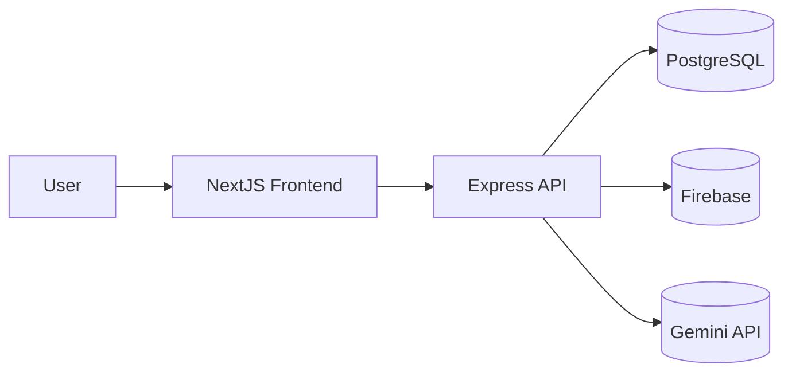
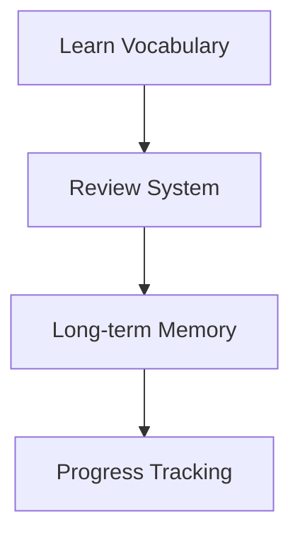

<div align="center">

# 🚀 AV_EngApp


<br/>

<p align="center">
  
  
  
  
</p>

<p align="center">
  
  
  
  
</p>

<br/>

<h3 align="center">
AI Powered English Learning Platform
</h3>

<p align="center">
Learn Vocabulary • AI Chat • Speaking • Journal • Gamification
</p>

</div>

---

<div align="center">


# AI-Powered English Learning Platform

### Learn smarter with AI, vocabulary systems, speaking practice, journals, and gamification.


</div>

---

# ✨ Features

<div align="center">

| 📚 Learning         | 🤖 AI Features        | 🎮 Gamification |
| ------------------- | --------------------- | --------------- |
| Vocabulary Learning | AI Chat Tutor         | XP System       |
| Flashcards          | Grammar Correction    | Daily Streaks   |
| Smart Review (SRS)  | AI Journal Feedback   | Challenges      |
| Listening Practice  | Speaking Analysis     | Leaderboards    |
| Typing Practice     | Translation Assistant | Rewards         |

</div>

## 📚 Vocabulary Learning

* Oxford vocabulary system
* Flashcards
* Smart review system (SRS)
* Vocabulary notebook
* Typing practice
* Listening practice

---

## 🤖 AI Features

* AI Chat Tutor
* Grammar correction
* AI journal feedback
* Speaking analysis
* Pronunciation scoring
* Translation assistant

---

## 🎮 Gamification

* XP system
* Leaderboards
* Daily streaks
* Challenges
* Review rewards

---

## 🧠 Smart Learning System

* Spaced Repetition Algorithm
* Review scheduling
* Learning progress tracking
* Personalized learning flow

---

# 🌈 Tech Stack

| Layer          | Technology                     |
| -------------- | ------------------------------ |
| Frontend       | NextJS App Router + TypeScript |
| Styling        | TailwindCSS                    |
| Backend        | NodeJS + ExpressJS             |
| Database       | PostgreSQL (Supabase)          |
| ORM            | Prisma                         |
| Authentication | Firebase Auth                  |
| Storage        | Firebase Storage               |
| AI             | GEMINI API                     |
| Deployment     | Render                         |

---

# 🧩 System Architecture

<div align="center">

```text
                USERS
                  │
                  ▼
          NextJS Frontend
             (Render)
                  │
                  ▼
          ExpressJS Backend
             (Render)
                  │
      ┌───────────┼───────────┐
      ▼           ▼           ▼
 PostgreSQL   Firebase      GEMINI
  Supabase    Auth/Store      AI
```

</div>

---



---

# 📁 Project Structure

```bash
AV_EngApp/
│
├── client/
│   ├── src/
│   │   ├── app/
│   │   │   ├── chat/
│   │   │   ├── dictionary/
│   │   │   ├── games/
│   │   │   ├── journal/
│   │   │   ├── leaderboard/
│   │   │   ├── learn/
│   │   │   ├── listening/
│   │   │   ├── login/
│   │   │   ├── notebook/
│   │   │   ├── profile/
│   │   │   ├── review/
│   │   │   ├── speaking/
│   │   │   └── translate/
│   │   │
│   │   ├── components/
│   │   ├── context/
│   │   ├── lib/
│   │   └── services/
│   │
│   └── package.json
│
├── server/
│   ├── prisma/
│   │   ├── schema.prisma
│   │   └── seed.ts
│   │
│   ├── scripts/
│   │   ├── enrich-vocab.js
│   │   ├── parse-srt-seed.js
│   │   └── seed-oxford.js
│   │
│   ├── src/
│   │   ├── controllers/
│   │   ├── middleware/
│   │   ├── routes/
│   │   ├── services/
│   │   ├── config/
│   │   └── lib/
│   │
│   └── package.json
│
├── LICENSE
└── README.md
```

---

# ⚡ Quick Start

## 1. Clone Repository

```bash
git clone https://github.com/Tunaanhgamedev/AV_EngApp.git
cd AV_EngApp
```

---

## 2. Install Dependencies

### Frontend

```bash
cd client
npm install
```

### Backend

```bash
cd ../server
npm install
```

---

# 🔑 Environment Variables

## Frontend `.env.local`

```env
NEXT_PUBLIC_API_URL=http://localhost:5000/api
NEXT_PUBLIC_FIREBASE_API_KEY=
NEXT_PUBLIC_FIREBASE_AUTH_DOMAIN=
NEXT_PUBLIC_FIREBASE_PROJECT_ID=
NEXT_PUBLIC_FIREBASE_STORAGE_BUCKET=
NEXT_PUBLIC_FIREBASE_MESSAGING_SENDER_ID=
NEXT_PUBLIC_FIREBASE_APP_ID=
```

---

## Backend `.env`

```env
PORT=5000
NODE_ENV=development
DATABASE_URL=
DIRECT_URL=
GEMINI_API_KEY=
JWT_SECRET=
```

> [!NOTE]
> Firebase Admin SDK is initialized using the `firebase-service-account.json` file placed directly in the `server/` directory.

---

# 🗄️ Database Setup

```bash
cd server
npx prisma migrate dev
npx prisma db seed
```

---

# ▶️ Run Development

## Backend

```bash
cd server
npm run dev
```

## Frontend

```bash
cd client
npm run dev
```

---

# 🚀 Deployment

<div align="center">

| Service        | Platform            |
| -------------- | ------------------- |
| Frontend       | Render Static Site  |
| Backend        | Render Web Service  |
| Database       | Supabase PostgreSQL |
| Storage        | Firebase Storage    |
| Authentication | Firebase Auth       |
| AI Engine      | GEMINIAI API        |

</div>

---

## Frontend

Deploy on Render Static Site.

## Backend

Deploy on Render Web Service.

## Database

Use Supabase PostgreSQL.

---

# 🔒 Security

❌ Never commit:

* `.env`
* `firebase-service-account.json`
* GeminiAI keys
* Firebase private keys
* Database credentials

---

# 🧠 Learning Flow



---

# 🛣️ Roadmap

```text
Phase 1 → Vocabulary + Authentication
Phase 2 → AI Chat + Journal + Speaking
Phase 3 → Gamification + Leaderboards
Phase 4 → Mobile App + Multiplayer + AI Avatar
```

---

## Phase 1

* Vocabulary system
* Authentication
* Review system

## Phase 2

* AI tutor
* Speaking AI
* Journal AI

## Phase 3

* Mobile app
* Multiplayer learning
* AI avatars

---

# 🤝 Contributing

Pull requests and contributions are welcome.

---

# 📄 LICENSE (MIT)

```text
MIT License

Copyright (c) 2026 Tunaanhgamedev

Permission is hereby granted, free of charge, to any person obtaining a copy
of this software and associated documentation files (the "Software"), to deal
in the Software without restriction, including without limitation the rights
to use, copy, modify, merge, publish, distribute, sublicense, and/or sell
copies of the Software, and to permit persons to whom the Software is
furnished to do so, subject to the following conditions:

The above copyright notice and this permission notice shall be included in all
copies or substantial portions of the Software.

THE SOFTWARE IS PROVIDED "AS IS", WITHOUT WARRANTY OF ANY KIND, EXPRESS OR
IMPLIED, INCLUDING BUT NOT LIMITED TO THE WARRANTIES OF MERCHANTABILITY,
FITNESS FOR A PARTICULAR PURPOSE AND NONINFRINGEMENT. IN NO EVENT SHALL THE
AUTHORS OR COPYRIGHT HOLDERS BE LIABLE FOR ANY CLAIM, DAMAGES OR OTHER
LIABILITY, WHETHER IN AN ACTION OF CONTRACT, TORT OR OTHERWISE, ARISING FROM,
OUT OF OR IN CONNECTION WITH THE SOFTWARE OR THE USE OR OTHER DEALINGS IN THE
SOFTWARE.
```
