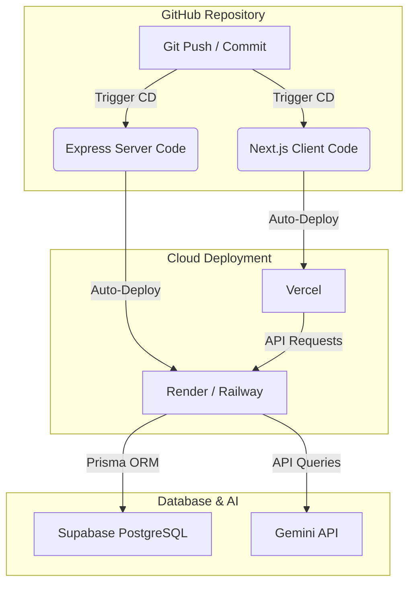

# Hướng Dẫn Triển Khai Lên Internet & Tích Hợp CI/CD Tự Động (EngBot)

Tài liệu này hướng dẫn chi tiết từng bước cách đưa toàn bộ hệ thống **EngBot** (bao gồm Express Backend, Next.js Frontend, Prisma & Supabase PostgreSQL) lên internet hoàn toàn miễn phí và cấu hình **Continuous Deployment (CD)** để mỗi lần bạn `git push` code lên GitHub, hệ thống sẽ tự động cập nhật.

---

## 🏗️ Kiến Trúc Triển Khai (Production Architecture)



---

## 🟢 Bước 1: Chuẩn Bị Kho Mã Nguồn GitHub (GitHub Repository)

Hệ thống CI/CD hoạt động dựa trên các thay đổi trên kho mã nguồn của bạn. Nếu chưa đưa code lên GitHub, hãy thực hiện các lệnh sau tại thư mục gốc:

1. **Khởi tạo và commit code:**
   ```bash
   git init
   git add .
   git commit -m "feat: complete settings page and layout responsiveness"
   ```
2. **Tạo Repository mới trên GitHub** và liên kết code của bạn:
   ```bash
   git remote add origin https://github.com/TaikhoanCuaBan/AV_EngApp.git
   git branch -M main
   git push -u origin main
   ```

---

## 🔵 Bước 2: Triển Khai Express Backend Lên Render

[Render](https://render.com) là nền tảng tối ưu nhất hiện nay để triển khai Node.js backend miễn phí, hỗ trợ tự động build và deploy từ GitHub.

### 1. Tạo Dịch Vụ Mới Trên Render
1. Truy cập [Render Dashboard](https://dashboard.render.com) và đăng nhập bằng tài khoản GitHub của bạn.
2. Nhấp vào nút **New +** và chọn **Web Service**.
3. Kết nối với kho mã nguồn GitHub `AV_EngApp` của bạn.

### 2. Cấu Hình Thông Tin Build & Deploy
Cấu hình các trường thông tin chính xác như sau để Render định vị được thư mục `/server` trong monorepo:

*   **Name:** `engbot-backend` (hoặc tên tùy chọn của bạn)
*   **Region:** Chọn khu vực gần Việt Nam nhất (ví dụ: `Singapore` hoặc `Oregon`).
*   **Branch:** `main`
*   **Root Directory:** `server` *(Rất quan trọng! Điều này chỉ định Render chạy trong thư mục server)*
*   **Runtime:** `Node`
*   **Build Command:**
    ```bash
    npm install && npx prisma generate && npm run build
    ```
*   **Start Command:**
    ```bash
    npm start
    ```
*   **Instance Type:** Chọn gói **Free** ($0/month).

### 3. Thiết Lập Biến Môi Trường (Environment Variables)
Nhấp vào tab **Environment** trên Render và thêm các biến môi trường sau:

| Tên Biến | Giá Trị | Ghi Chú |
| :--- | :--- | :--- |
| `NODE_ENV` | `production` | Chế độ chạy Production |
| `PORT` | `10000` | Cổng dịch vụ của Render |
| `DATABASE_URL` | `postgresql://...` | Đường dẫn kết nối **Session (Port 5432)** của Supabase |
| `DIRECT_URL` | `postgresql://...` | Đường dẫn kết nối trực tiếp của Supabase (dành cho di chuyển schema) |
| `GEMINI_API_KEY` | `AIzaSy...` | Khóa API Gemini của bạn |
| `JWT_SECRET` | `ChuoiKyTuBaoMatCuaBan` | Chuỗi khóa bí mật dùng mã hóa dữ liệu phiên đăng nhập |

---

## 🟡 Bước 3: Triển Khai Next.js Frontend Lên Vercel

[Vercel](https://vercel.com) là "cha đẻ" của Next.js, cung cấp dịch vụ hosting đỉnh cao, tối ưu hóa tốc độ tải trang toàn cầu và tích hợp CI/CD tự động chỉ trong vài giây.

### 1. Tạo Project Mới Trên Vercel
1. Truy cập [Vercel Dashboard](https://vercel.com) và đăng nhập bằng tài khoản GitHub.
2. Nhấp vào **Add New...** -> **Project**.
3. Tìm kho mã nguồn `AV_EngApp` và nhấp vào nút **Import**.

### 2. Cấu Hình Thư Mục Monorepo
*   **Framework Preset:** `Next.js`
*   **Root Directory:** Nhấp vào **Edit** và chọn thư mục `client`. Vercel sẽ tự động hiểu đây là dự án Next.js nằm trong thư mục con!
*   **Build and Output Settings:** Giữ mặc định (Vercel sẽ tự động chạy `npm run build` thích hợp).

### 3. Thiết Lập Biến Môi Trường (Environment Variables)
Mở rộng phần **Environment Variables** và cấu hình biến liên kết đến Backend vừa deploy:

| Tên Biến | Giá Trị | Ghi Chú |
| :--- | :--- | :--- |
| `NEXT_PUBLIC_API_URL` | `https://engbot-backend.onrender.com/api` | Đường dẫn API Backend của bạn trên Render |
| `NEXT_PUBLIC_FIREBASE_API_KEY` | `AIzaSy...` | Firebase config của bạn |
| `NEXT_PUBLIC_FIREBASE_AUTH_DOMAIN` | `...` | Firebase config của bạn |
| `NEXT_PUBLIC_FIREBASE_PROJECT_ID` | `...` | Firebase config của bạn |
| `NEXT_PUBLIC_FIREBASE_STORAGE_BUCKET` | `...` | Firebase config của bạn |
| `NEXT_PUBLIC_FIREBASE_MESSAGING_SENDER_ID` | `...` | Firebase config của bạn |
| `NEXT_PUBLIC_FIREBASE_APP_ID` | `...` | Firebase config của bạn |

Nhấp vào nút **Deploy**. Vercel sẽ tiến hành biên dịch ứng dụng Next.js chỉ trong vòng 1-2 phút và cấp cho bạn một tên miền miễn phí dạng `https://engbot-client.vercel.app`.

---

## ⚙️ Bước 4: Cấu Hình CORS Trên Server (Cho Phép Frontend Gọi API)

Để Frontend trên Vercel có thể gọi API đến Backend trên Render thành công mà không bị lỗi bảo mật **CORS (Cross-Origin Resource Sharing)**, chúng ta cần cấu hình cho phép tên miền của Vercel truy cập.

Hãy mở file [server/src/app.ts](file:///e:/AV_EngApp/server/src/app.ts) và tinh chỉnh cấu hình CORS như sau:

```typescript
app.use(cors({
  origin: [
    'http://localhost:3000', 
    'https://ten-mien-cua-ban.vercel.app' // Thay bằng tên miền thực tế Vercel cấp cho bạn
  ],
  credentials: true
}));
```

---

## 🔄 Quy Trình Tự Động Hóa CI/CD Toàn Diện (GitHub Actions)

Dự án đã được cấu hình bộ tích hợp và triển khai tự động chuyên nghiệp **GitHub Actions** tại file `.github/workflows/ci-cd.yml`. Mỗi khi có commit mới được `git push` hoặc `Pull Request`:

1.  **Phía Kiểm Tra (CI)**:
    *   Hệ thống sẽ chạy song song hai luồng build để kiểm tra lỗi biên dịch TypeScript và đóng gói Next.js (ở cả client và server).
    *   Nếu code có lỗi biên dịch, GitHub Actions sẽ báo đỏ 🔴 ngay lập tức để bạn sửa lỗi trước khi ảnh hưởng đến sản phẩm trực tuyến.
2.  **Phía Triển Khai (CD)**:
    *   Sau khi hai luồng build kiểm tra thành công, nếu nhánh là `main`/`master`, GitHub Actions sẽ tự động kích hoạt tiến trình Deploy 🚀 lên **Vercel** và **Render**.

### 🔑 Cấu Hình GitHub Secrets (Để Tự Động Hóa Deploy CD)
Để GitHub Actions có quyền truy cập và triển khai ứng dụng của bạn, hãy vào trang Repository của bạn trên GitHub, chọn **Settings** -> **Secrets and variables** -> **Actions** -> click **New repository secret** và thêm các biến khóa sau:

1.  **`RENDER_DEPLOY_HOOK_URL`**:
    *   *Cách lấy:* Vào Render Dashboard -> Chọn Web Service của bạn -> Tab **Settings** -> Cuộn xuống tìm dòng **Deploy Hook** -> Sao chép URL hiển thị (dạng `https://api.render.com/deploy/srv-...`).
2.  **`VERCEL_TOKEN`**:
    *   *Cách lấy:* Vào Vercel Dashboard -> Chọn **Account Settings** -> **Tokens** -> Click **Create** để sinh mã Token mới với quyền Admin.
3.  **`VERCEL_ORG_ID`** và **`VERCEL_PROJECT_ID`**:
    *   *Cách lấy:* Chạy lệnh `vercel link` ở thư mục client trên máy cá nhân để liên kết dự án, thông tin ID sẽ nằm trong file cấu hình `.vercel/project.json`. Hoặc xem trực tiếp trong phần Settings dự án Vercel.

---
